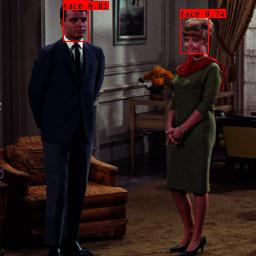

# YoloV3 Face

Implement Face detection using keras-yolo3.

## Requirements

- Keras 2.2.4 or lower (Issue : https://github.com/qqwweee/keras-yolo3/issues/544)
- Tensorflow 1.13.2 or lower (Issue : https://github.com/NVIDIA/TensorRT/issues/339)
- keras2onnx 1.5.1 (1.5.2 failed to convert onnx)
- keras-yolo3 (checked on version Jul 31, 2018 e6598d13c703029b2686bc2eb8d5c09badf42992)
- Python 3.5 or later
- OpenCV

## Install

    git submodule init
    git submodule update

## Create dataset

Download fddb dataset (FDDB-folds and originalPics folder) and put in the each folder.

http://vis-www.cs.umass.edu/fddb/

Folder layout examples.

    f:/fddb/FDDB-folds/*.txt
    f:/fddb/originalPics/2002/*
    f:/fddb/originalPics/2003/*

Create annotation data.

    python annotation.py f:/fddb/

Create masked annotation data.

    python3 annotation-medical-mask-dataset.py

## Training

Training from 2845 pictures.

    python train.py f:/fddb/ ./model_data/face_classes.txt ./model_data/tiny_yolo_anchors.txt

Trained from 678 pictures.

    python3 train.py ./medical-mask-dataset/ ./model_data/mask_classes.txt ./model_data/tiny_yolo_anchors.txt

This is an output data path.

    ./model_data/log/trained_weights_final.h5

## Convert to ONNX

    cd keras-onnx
    python keras-yolo3-to-onnx.py ../model_data/logs/trained_weights_final.h5 ../model_data/face_classes.txt ../model_data/tiny_yolo_anchors.txt ../model_data/ax_face.onnx

## Inference using ONNX Runtime

    cd keras-onnx
    python inference.py ../model_data/ax_face.onnx ../model_data/face_classes.txt ../images/couple.jpg output.jpg

## Convert to ailia SDK

Optimize onnx file and export prototxt file

    cd onnx-ailia
    python onnx_optimizer.py --yolov3 ../model_data/ax_face.onnx
    python onnx2prototxt ../model_data/ax_face.opt.onnx

## Inference using ailia SDK

Inference using detector API

    cd onnx-ailia
    python inference.py ../model_data/ax_face.opt.onnx ../model_data/face_classes.txt ../images/couple.jpg output.jpg

## Reference

- keras-yolo3 : https://github.com/qqwweee/keras-yolo3
- keras2onnx : https://github.com/onnx/keras-onnx/tree/master/applications/yolov3
